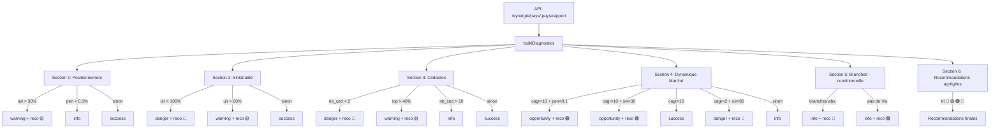

# 📋 Rapport de Recommandation — Logique Complète

> **Page** : `/analyse-synergie/:nom_pays` → onglet **"📋 Rapport de Recommandation"**  
> **Fichier source** : `frontend/src/pages/AnalyseSynergiePays.tsx`  
> **Fonction principale** : `buildDiagnostics(rapport, params)`

---

## Vue d'ensemble

Le rapport est un **système de diagnostic automatique** qui analyse la position stratégique d'Atlantic Re sur un marché pays donné. Il génère jusqu'à **6 sections** ordonnées, chacune produisant un diagnostic coloré et des recommandations stratégiques triées par priorité.

### Flux de données

```
API /synergie/pays/:pays/rapport
        ↓
   interface Rapport
        ↓
   buildDiagnostics(rapport, rapportParams)
        ↓
   diagnostics[] → rendu JSX avec sectionStyle(classe)
```

---

## Données d'entrée

### Interface `Rapport` (données issues de l'API)

| Champ | Type | Description |
|---|---|---|
| `pays` | `string` | Nom du pays analysé |
| `primes_marche_total_mad` | `number` | Primes totales du marché (MAD) |
| `primes_nonvie_mad` | `number` | Primes marché Non-Vie (MAD) |
| `primes_vie_mad` | `number` | Primes marché Vie (MAD) |
| `subject_premium` | `number` | Primes des affaires soumises à Atlantic Re |
| `written_premium` | `number` | Primes effectivement souscrites par Atlantic Re |
| `share_written_avg` | `number` | Part moyenne souscrite par Atlantic Re sur les affaires participées (%) |
| `penetration_marche_pct` | `number` | Pénétration réelle d'Atlantic Re sur le marché total (%) |
| `ulr_moyen` | `number` | Taux de Sinistres Acquis moyen — Ult. Loss Ratio (%) |
| `nb_cedantes` | `number` | Nombre de cédantes actives dans le pays |
| `nb_affaires` | `number` | Nombre d'affaires traitées |
| `croissance_marche_cagr` | `number` | CAGR du marché total (%/an) |
| `croissance_written_cagr` | `number` | CAGR des primes Atlantic Re (%/an) |
| `cedantes_detail` | `CedanteDetail[]` | Détail par cédante (dont `pct_written_vs_pays`) |
| `branches_presentes` | `string[]` | Branches d'assurance où Atlantic Re est active |
| `branches_absentes` | `string[]` | Branches d'assurance non explorées |
| `evolution_marche` | `object[]` | Évolution historique du marché par année |
| `evolution_atlantic` | `object[]` | Évolution historique des métriques Atlantic Re |

### Formule clé : Pénétration Réelle

```
penetration_marche_pct = SHARE_WRITTEN × (Subject Premium / Primes Marché) × 100
```

> C'est l'**indicateur principal** — il mesure la part réelle d'Atlantic Re sur l'ensemble du marché (pas juste sur les affaires participées).

---

## Paramètres configurables (`RapportParams`)

L'utilisateur peut ajuster ces seuils via le panneau **⚙ Paramètres** (bouton dans l'en-tête du rapport). Tous les seuils sont exprimés en **%** sauf `seuil_cedantes_min` et `seuil_cedantes_max` qui sont des **nombres entiers**.

| Paramètre | Valeur par défaut | Signification |
|---|---|---|
| `seuil_part_elevee` | **30 %** | Si `share_written_avg > 30%` → concentration sur les affaires |
| `seuil_part_faible` | **5 %** | (Défini, non utilisé dans les diagnostics actuels) |
| `seuil_ulr_risque` | **80 %** | Si `ulr_moyen > 80%` → sinistralité préoccupante |
| `seuil_ulr_critique` | **100 %** | Si `ulr_moyen > 100%` → sinistralité critique (perte nette) |
| `seuil_cedantes_min` | **2** | Si `nb_cedantes < 2` → situation mono-cédante critique |
| `seuil_cedantes_max` | **10** | Si `nb_cedantes > 10` → portefeuille trop étendu |
| `seuil_croissance_elevee` | **10 %** | Si `cagr > 10%` → marché en forte croissance |
| `seuil_penetration_faible` | **0.1 %** | Si `penetration < 0.1%` → sous-représentation sur le marché |
| `seuil_cedante_dominante` | **40 %** | Si top cédante > 40% des primes → concentration bilatérale |

---

## Architecture du système de diagnostic

La fonction `buildDiagnostics` retourne un tableau de `{ section, classe, text }`.

### Classes CSS et couleurs associées

| `classe` | Couleur barre gauche | Fond | Signification |
|---|---|---|---|
| `danger` | Rouge `hsl(358,66%,54%)` | Rouge clair | Situation critique, action urgente |
| `warning` | Orange `hsl(30,88%,56%)` | Orange clair | Alerte, surveillance requise |
| `success` | Vert `hsl(152,56%,39%)` | Vert clair | Situation saine |
| `opportunity` | Or `hsl(43,96%,48%)` | Or clair | Opportunité de croissance |
| `info` | Bleu-gris `hsl(209,35%,40%)` | Gris clair | Information neutre |

---

## Sections du rapport (détail de la logique)

### Section 1 — Positionnement Atlantic Re

**Variables analysées** : `share_written_avg (sw)`, `penetration_marche_pct (pen)`

| Condition | Classe | Message généré |
|---|---|---|
| `sw > seuil_part_elevee (> 30%)` | `warning` | ⚠️ CONCENTRATION SUR LES AFFAIRES — Part X% dépasse le seuil de 30%. Surveiller l'exposition. |
| `pen < seuil_penetration_faible (< 0.1%)` | `info` | 🟡 SOUS-REPRÉSENTATION SUR LE MARCHÉ — Pénétration réelle X%, marge de progression significative. |
| *(aucune des conditions)* | `success` | ✅ POSITIONNEMENT ÉQUILIBRÉ — Part X% sur les affaires, pénétration réelle X% du marché. |

**Recommandation générée si warning** :
```
🟡 IMPORTANT — Surveiller la concentration : part X% > seuil 30%
```

> ⚠️ Note : la condition `sw > 30%` est testée **en premier** (priorité sur la pénétration faible).

---

### Section 2 — Sinistralité

**Variable analysée** : `ulr_moyen (ulr)`

| Condition | Classe | Message généré |
|---|---|---|
| `ulr > seuil_ulr_critique (> 100%)` | `danger` | ⛔ SINISTRALITÉ CRITIQUE — ULR X%, Atlantic Re perd de l'argent. RECOMMANDATION URGENTE : réduire l'exposition, renégocier, envisager la résiliation. |
| `ulr > seuil_ulr_risque (> 80%)` | `warning` | ⚠️ SINISTRALITÉ PRÉOCCUPANTE — ULR X% (seuil : 80%). Renforcer la sélection des risques. |
| *(aucune)* | `success` | ✅ SINISTRALITÉ SAINE — ULR X%, dans les normes. |

**Recommandation générée** :
- Si critique : `🔴 URGENT — Réduire l'exposition : ULR critique X%`
- Si risque : `🟡 IMPORTANT — Sinistralité préoccupante : ULR X%`

> Le seuil `seuil_ulr_critique` est testé **avant** `seuil_ulr_risque` (cascade).

---

### Section 3 — Diversification des Cédantes

**Variables analysées** : `nb_cedantes`, `cedantes_detail[0].pct_written_vs_pays (pct_top)`

| Condition | Classe | Message généré |
|---|---|---|
| `nb_cedantes < seuil_cedantes_min (< 2)` | `danger` | 🔴 MONO-CÉDANTE — X cédante(s). SEUIL CRITIQUE : toute résiliation = sortie totale du marché. |
| `pct_top > seuil_cedante_dominante (> 40%)` | `warning` | 🔶 CONCENTRATION BILATÉRALE — [top cédante] représente X% des primes. |
| `nb_cedantes > seuil_cedantes_max (> 10)` | `info` | ℹ️ PORTEFEUILLE ÉTENDU — X cédantes. Analyser la performance individuelle. |
| *(aucune)* | `success` | ✅ DIVERSIFICATION ÉQUILIBRÉE — X cédantes actives, répartition saine. |

**Recommandations générées** :
- Si mono-cédante : `🔴 URGENT — Prospecter une 2ème cédante : situation mono-cédante`
- Si dominante : `🟡 IMPORTANT — Rééquilibrer : [top cédante] = X% des primes`

> La `top cédante` est `cedantes_detail[0]` (premier élément — supposé trié par `pct_written_vs_pays` DESC par l'API).

---

### Section 4 — Dynamique du Marché

**Variables analysées** : `croissance_marche_cagr (cagr)`, `penetration_marche_pct (pen)`, `share_written_avg (sw)`, `ulr_moyen (ulr)`

| Condition (ordre d'évaluation) | Classe | Message généré |
|---|---|---|
| `cagr > 10% ET pen < 0.1%` | `opportunity` | 🚀 OPPORTUNITÉ DE CROISSANCE FORTE — Marché +X%/an et pénétration seulement X%. Augmenter activement la présence. |
| `cagr > 10% ET sw > 30%` | `opportunity` | 📈 MARCHÉ EN FORTE CROISSANCE — RENFORCER AVEC PRUDENCE — Accompagner la croissance sans dépasser le seuil de concentration. |
| `cagr > 10%` (seul) | `success` | 📈 MARCHÉ EN CROISSANCE — Atlantic Re bien positionnée. Maintenir la présence. |
| `cagr < 2% ET ulr > 80%` | `danger` | 📉 DOUBLE SIGNAL NÉGATIF — Stagnation + sinistralité élevée. Réduire progressivement l'exposition. |
| *(aucune)* | `info` | 📊 MARCHÉ STABLE — Croissance X%/an. Maintenir la présence actuelle. |

**Recommandations générées** :
- `🟢 OPPORTUNITÉ — Augmenter la pénétration : marché +X%/an, sous-représentation confirmée`
- `🟢 OPPORTUNITÉ — Accompagner la croissance X%/an avec prudence`
- `🔴 URGENT — Réduire progressivement : stagnation + sinistralité élevée`

> ⚠️ **Ordre critique** : les conditions sont évaluées **en cascade** (if / else if). La première condition vraie prend la main.

---

### Section 5 — Opportunités par Branche

**Variables analysées** : `branches_absentes`, `branches_presentes`, `primes_vie_mad`

> Cette section est **conditionnelle** : elle n'apparaît que si au moins une de ces conditions est vraie.

| Condition | Message généré |
|---|---|
| `branches_absentes.length > 0` | 🌱 BRANCHES NON EXPLOITÉES — Atlantic Re est absente de N branche(s) : [liste]. Opportunités d'expansion. |
| `!branches_presentes.includes('VIE') && primes_vie_mad > 0` | 💡 Marché Vie [montant] sans présence Atlantic Re — opportunité à évaluer. |

**Recommandations générées** :
- `🔵 À SURVEILLER — Branches non exploitées : [liste]`
- `🟢 OPPORTUNITÉ — Explorer la branche Vie : marché [montant], aucune affaire`

> Les deux sous-conditions peuvent être **simultanément** vraies dans la même section.

---

### Section 6 — Recommandations Stratégiques

**Source** : agrégation de toutes les recommandations générées par les sections 1 à 5.

**Tri par priorité** :
```
🔴 URGENT  →  🟡 IMPORTANT  →  🟢 OPPORTUNITÉ  →  🔵 À SURVEILLER
```

| Cas | Classe de la section | Affichage |
|---|---|---|
| Au moins un `🔴` | `danger` | Liste triée des recommandations |
| Au moins un `🟡` (sans `🔴`) | `warning` | Liste triée des recommandations |
| Sinon (vert/bleu ou aucun) | `success` | Liste triée OU "✅ Aucune action urgente." |

---

## Panneau Paramètres ⚙

Un toggle **"⚙ Paramètres"** dans l'en-tête du rapport ouvre un formulaire de contrôle des seuils. Chaque seuil est un `<input type="number">` modifiable en temps réel.

Le recalcul est **100% côté client** (pas de nouvel appel API) : `buildDiagnostics` est réexécuté via `useMemo` chaque fois que `rapportParams` change.

Un bouton **"Réinitialiser"** restore les valeurs par défaut (`DEFAULT_PARAMS`).

---

## Données sources affichées en bas du rapport

Après les 6 sections, si `cedantes_detail.length > 0`, un bloc "Données sources" affiche :

- **CAGR marché** et **CAGR Atlantic Re** en %/an
- **Branches présentes** → badges dorés
- **Branches absentes** → badges gris (si applicable)

---

## Résumé de la logique globale



---

## Exemple de scénario

**Pays fictif : Burkina Faso 2024**

| Métrique | Valeur | Seuil |
|---|---|---|
| `share_written_avg` | 18% | — |
| `penetration_marche_pct` | 0.05% | **< 0.1%** ✓ |
| `ulr_moyen` | 115% | **> 100%** ✓ |
| `nb_cedantes` | 1 | **< 2** ✓ |
| `cagr` | 12% | **> 10%** ✓ |
| `branches_absentes` | ["CORPS", "RC"] | > 0 ✓ |

**Résultat attendu** :
- Section 1 → `info` (pénétration faible)
- Section 2 → `danger` + reco `🔴`
- Section 3 → `danger` + reco `🔴`
- Section 4 → `opportunity` (cagr > 10% ET pen < 0.1%) + reco `🟢`
- Section 5 → `info` + reco `🔵`
- Section 6 → classe `danger`, recos triées : `🔴 🔴 🟢 🔵`
